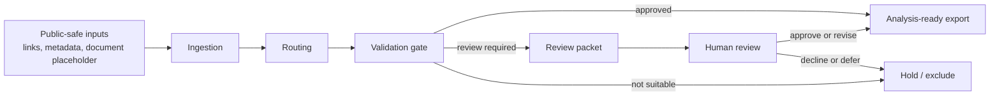

# Review-Gated Research Systems

Review-Gated Research Systems is a sanitized public showcase of a verification-oriented, AI-assisted research workflow. The system is built around explicit routing, validation gates, structured review packets, and downstream-safe export. Its purpose is not to present AI as autonomous end-to-end research. The point is that machine assistance can improve intake structure, surface uncertainty early, preserve inspectable artifacts, and make human review easier before questionable material enters later research use.

## Why This Matters

Many research-support workflows fail at handoff points. A record can be partially described, weakly extracted, or ambiguously sourced and still look “complete enough” to move forward. That creates verification debt later. A review-gated design addresses that problem directly by keeping uncertainty visible, preserving the reason a record was paused, and separating analysis-ready outputs from unresolved records.

## What This Repository Demonstrates

- structured intake of links and document-like artifacts
- explicit routing into source-appropriate workflow lanes
- validation before downstream reuse
- review-packet generation for uncertain or degraded records
- simple status, progress, and provenance artifacts
- downstream-safe export only for records that clear the gate

## What You Can Inspect In 60 Seconds

1. Sample inputs:
   [`demo/sample_inputs/sample_links.csv`](./demo/sample_inputs/sample_links.csv),
   [`demo/sample_inputs/sample_metadata.json`](./demo/sample_inputs/sample_metadata.json),
   [`demo/sample_inputs/sample_pdf_placeholder.txt`](./demo/sample_inputs/sample_pdf_placeholder.txt)
2. Routing decisions:
   [`demo/sample_outputs/routing_decisions.json`](./demo/sample_outputs/routing_decisions.json)
3. Review packet:
   [`demo/sample_outputs/review_packet.md`](./demo/sample_outputs/review_packet.md)
4. Analysis-ready export:
   [`demo/sample_outputs/final_export.json`](./demo/sample_outputs/final_export.json)
5. Status surface:
   [`demo/sample_outputs/system_status.csv`](./demo/sample_outputs/system_status.csv)

## Architecture Overview



If Mermaid does not render cleanly in your viewer, the intended reading is simple: nothing becomes analysis-ready until it clears validation. Uncertain records generate review artifacts. Unsuitable records are held back rather than passed downstream.

Additional diagrams are collected in [`diagrams/README.md`](./diagrams/README.md).

## Design Principles

1. Review-gated by default
2. Validation before downstream reuse
3. Human review is a normal state transition, not an exception
4. Inspectable artifacts are more valuable than opaque automation
5. Conservative outputs are preferable to silent overreach
6. Public claims should stay narrower than private implementation scope

## Public Showcase Vs Private System

This repository is intentionally selective.

Public showcase:
- uses toy inputs and sanitized outputs
- demonstrates routing, validation, review, and export logic
- exposes inspectable artifacts that make the workflow legible
- is safe to share in outreach, teaching, and portfolio settings

Private system:
- includes broader operational context not published here
- may contain domain-specific logic, private datasets, or non-public artifacts
- is not represented here as a complete end-to-end research environment

## Who This Is For

- professors exploring AI-assisted research operations
- labs and centers thinking about digitization, intake discipline, and review workflows
- collaborators interested in productivity, organizational design, and research infrastructure
- students or research assistants who want to inspect a serious, conservative systems-design example

## Quick Walkthrough

From the repository root:

```bash
python3 demo/run_demo.py
python3 -m unittest discover -s tests
```

The demo writes public-safe artifacts into [`demo/sample_outputs`](./demo/sample_outputs). The runnable path is intentionally small so that a first-time visitor can inspect the whole system quickly.

## Demo Path

If you want the shortest inspection route:

1. open the sample batch in [`demo/sample_inputs`](./demo/sample_inputs)
2. inspect routing in [`demo/sample_outputs/routing_decisions.json`](./demo/sample_outputs/routing_decisions.json)
3. inspect the review packet in [`demo/sample_outputs/review_packet.md`](./demo/sample_outputs/review_packet.md)
4. inspect the approved export in [`demo/sample_outputs/final_export.json`](./demo/sample_outputs/final_export.json)
5. inspect the status surface in [`demo/sample_outputs/system_status.csv`](./demo/sample_outputs/system_status.csv)

A compact navigation note is also available in [`demo/README.md`](./demo/README.md).

## Evaluation Framing

This repository does not treat “automation rate” as the main outcome. For research-support systems, the more relevant questions are:

- Is routing clear and inspectable?
- Are review gates preserved when evidence is weak or incomplete?
- Are downstream-safe exports separated from unresolved records?
- Can a reviewer see why a record was paused?
- Are degraded or ambiguous cases visible rather than hidden?
- Are failure cases preserved as inspectable artifacts?

More detail is in [`docs/evaluation.md`](./docs/evaluation.md).

## Case Study Communication

The public case study is structured around three evidence-quality profiles:

- a valid case that clears the gate
- an ambiguous case that should pause for review
- a degraded case that should remain visible but should not move downstream

The contribution is not “AI replaces researchers.” It is that AI can improve triage, structure, visibility, and review discipline while preserving human judgment where it matters.

See [`docs/case_study.md`](./docs/case_study.md).

## Repository Map

| Path | What it contains | Why a reader may care |
| --- | --- | --- |
| [`README.md`](./README.md) | public landing page | fastest way to understand the project |
| [`demo/`](./demo/) | runnable public-safe demo | quickest hands-on inspection path |
| [`demo/sample_inputs`](./demo/sample_inputs) | toy inputs | shows what enters the pipeline |
| [`demo/sample_outputs`](./demo/sample_outputs) | routed, reviewed, and exported artifacts | shows what the system produces |
| [`diagrams/`](./diagrams/) | architecture and flow diagrams | helps skim the design quickly |
| [`docs/`](./docs/) | architecture, evaluation, review logic, and case study notes | for deeper inspection |
| [`src/research_systems_showcase`](./src/research_systems_showcase) | minimal implementation | for readers who want to inspect code |
| [`tests/`](./tests/) | demo-level checks | shows the public demo is runnable and inspectable |

## Conservative Claims Only

This repository does not claim:

- fully autonomous end-to-end research
- benchmark leadership
- elimination of human review
- universal coverage across source types or research domains
- that output generation is the same thing as output trustworthiness

## What This System Does Not Claim To Do

It does not claim to replace faculty judgment, archival verification, domain expertise, or careful source evaluation. It demonstrates a workflow design pattern: uncertain records should remain visible, reviewable, and separate from analysis-ready outputs.

## Future Extensions

- richer public examples of degraded document handling
- more detailed review-memory and findings-memory artifacts
- broader evaluation cases for ambiguous records
- additional domain-specific validators
- richer status surfaces for batch monitoring

## Further Reading

- [`docs/architecture.md`](./docs/architecture.md)
- [`docs/design_principles.md`](./docs/design_principles.md)
- [`docs/review_logic.md`](./docs/review_logic.md)
- [`docs/evaluation.md`](./docs/evaluation.md)
- [`docs/case_study.md`](./docs/case_study.md)
- [`diagrams/README.md`](./diagrams/README.md)

## License And Citation

This repository is released under the MIT License. Citation metadata is provided in [`CITATION.cff`](./CITATION.cff).
