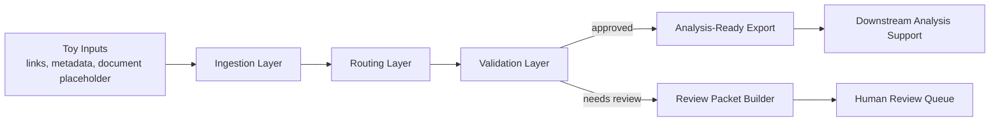
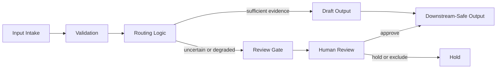

# Review-Gated Research Systems

Review-Gated Research Systems is a sanitized public showcase of a broader non-public research automation environment. It demonstrates validation-aware, human-in-the-loop system design for literature, link, and document intake, with review gates that prevent uncertain records from moving directly into downstream research use. The emphasis is conservative routing, provenance visibility, and downstream-safe outputs rather than autonomous research claims.

## What This Repository Is

- a compact public portfolio repository
- a runnable demo built on toy inputs and inspectable outputs
- an architecture-first public example of review-gated research systems

## What It Demonstrates

- structured intake of links and document-like artifacts
- routing into explicit system lanes
- validation before downstream use
- structured review packets for records that require human judgment
- downstream-ready exports for approved records
- provenance and progress visibility through simple artifacts

## Why This Matters For Research

Many research-support systems fail at the transition points between intake, interpretation, and downstream use. Weak metadata, degraded extraction, or uncertain evidence can move forward too easily if the system treats output generation as success. A review-gated design addresses that problem directly. It makes uncertainty visible, pauses questionable records early, and produces artifacts that are easier for faculty, research assistants, and PhD students to inspect before reuse.

## Architecture At A Glance



## Decision Flow



## Review-Gated Logic

| Situation | System behavior | Why it matters |
| --- | --- | --- |
| metadata is complete and checks pass | record is marked analysis-ready | downstream work begins from cleaner inputs |
| metadata is incomplete | record moves to review queue | citation and provenance problems stay visible |
| document extraction looks degraded | record is paused for review | weak text does not silently enter later analysis |
| uncertainty remains after automation | a structured review packet is prepared | human oversight is built into the system |

## Repository Structure

```text
repo_root/
├── .gitignore
├── README.md
├── LICENSE
├── CITATION.cff
├── CONTRIBUTING.md
├── pyproject.toml
├── requirements.txt
├── docs/
├── diagrams/
├── demo/
├── examples/
├── src/
│   └── research_systems_showcase/
└── tests/
```

## Quick Start

From the repository root:

```bash
python3 demo/run_demo.py
python3 -m unittest discover -s tests
```

The demo writes public-safe outputs into [`demo/sample_outputs`](./demo/sample_outputs).

## Example Outputs

- [`demo/sample_outputs/review_packet.md`](./demo/sample_outputs/review_packet.md): structured review packet for uncertain records
- [`demo/sample_outputs/analysis_brief.md`](./demo/sample_outputs/analysis_brief.md): downstream-facing brief for approved records
- [`demo/sample_outputs/system_status.csv`](./demo/sample_outputs/system_status.csv): compact status table across records
- [`demo/sample_outputs/final_export.json`](./demo/sample_outputs/final_export.json): structured export for later tooling

## Design Principles

- review-gated by default
- human oversight as a normal state transition, not an exception
- validation before downstream reuse
- modular stages with inspectable outputs
- conservative claims and reproducibility-minded design

More detail is available in:

- [`docs/architecture.md`](./docs/architecture.md)
- [`docs/case_study.md`](./docs/case_study.md)
- [`docs/design_principles.md`](./docs/design_principles.md)
- [`docs/evaluation.md`](./docs/evaluation.md)
- [`docs/review_logic.md`](./docs/review_logic.md)

## Limitations

- this is a sanitized public showcase, not the full private research environment it was derived from
- the demo uses simplified inputs and examples to illustrate system behavior, not to represent full operational scope
- human review remains necessary for ambiguous, degraded, or otherwise uncertain records
- the repository prioritizes cautious routing and downstream safety over maximal automation

## Public-Scope Note

This is a selective public showcase repository, not the full private system it was derived from. It excludes unpublished manuscripts, restricted source documents, environment-specific setup details, internal evaluation artifacts, and development-machine traces. The emphasis is on system architecture, validation logic, and public-safe demonstration outputs.

## License And Citation

This repository is released under the MIT License. Citation metadata is provided in [`CITATION.cff`](./CITATION.cff).
