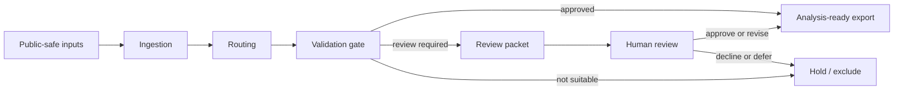
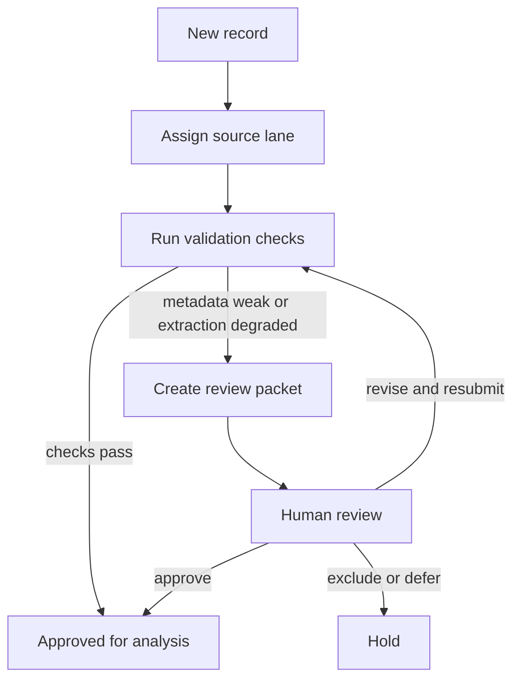
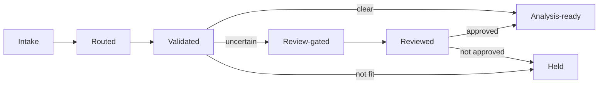
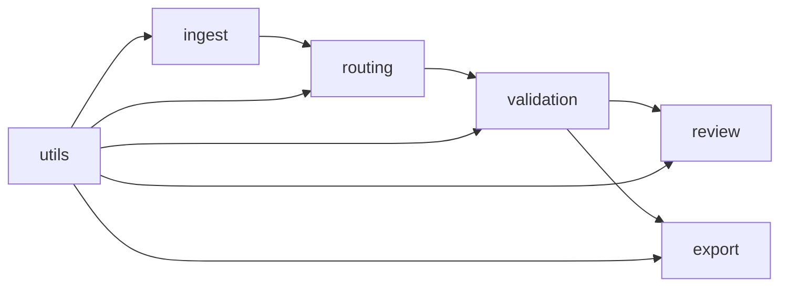

# Diagrams

This folder collects the main diagrams for the public showcase. The Mermaid versions below are intended for GitHub rendering. If Mermaid does not display well in your viewer, each diagram is followed by a short plain-language fallback explanation.

## 1. Top-Level Architecture

Fallback reading: records are ingested, routed, and validated before they are exported. Uncertain records go to review. Unsuitable records are held back.

## 2. Routing And Review Decision Flow

Fallback reading: the system does not force every record straight to export. If evidence is weak, it creates a review packet and waits for a human decision.

## 3. Compact Record Lifecycle

Fallback reading: the key lifecycle distinction is between analysis-ready, review-gated, and held records.

## 4. Module Map

Fallback reading: the public code is intentionally modular. Ingestion, routing, validation, review, and export are separated so each stage remains inspectable.
