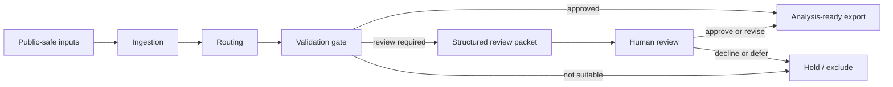
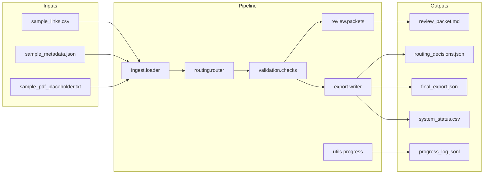

# Architecture

This public showcase demonstrates a compact version of a review-gated research system. The design favors inspectable stages over hidden automation and keeps uncertainty visible throughout the pipeline.

## System Overview

If Mermaid rendering is weak in your viewer, the fallback reading is: ingest first, route second, validate third, and only export after the record clears the gate. Review and hold states are explicit outcomes, not hidden exceptions.

## Module Boundaries

## Design Notes

- Inputs are treated as research support artifacts, not as automatically trusted evidence.
- Routing is explicit and narrow: the pipeline first decides where an item should go before asking whether it is ready to move forward.
- Validation is a gate, not a logging afterthought.
- Review packets are written for humans, with enough context to understand why an item was paused.
- Exports separate analysis-ready records from records still waiting for review.
- A downstream analysis brief is generated so approved records are immediately usable in later research-support tasks.

For quicker visual skimming, see [`../diagrams/README.md`](../diagrams/README.md).
